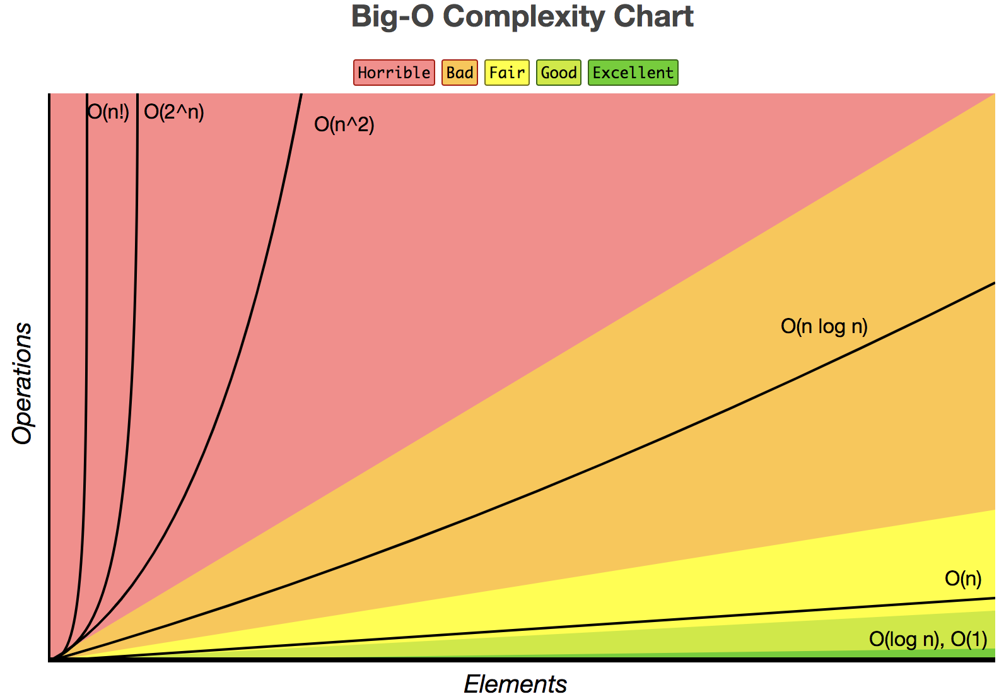

## 线性结构
### 数组

### 链表
### 栈
### 队列

## 树型结构
### 二叉树 （Binary Search Tree）
#### 遍历方式
* 前序遍历 根左右
* 中序遍历 左根右
* 后序遍历 左右根
### AVL树（平衡二叉树），红黑树(RBTree)
### B/B+树
### Trie树 (字典树)

### 

## 堆
## 图

## 排序算法
### 冒泡排序    
### 快速排序
### 插入排序
### 希尔排序
### 选择排序
### 堆排序
### 并归排序
### 桶排序
### 基数排序

## 大O表示法
* O(1)— 常数时间：该算法仅仅使用一步就可以完成任务
* O(log n)— 对数时间：该算法每执行一步，它完成任务所需要的步骤数目会以一定的因子减少。
* O(n)— 线性时间：该算法完成任务所需要的步骤直接和n相关（1对1的关系）。
* O(n²)— 二次方时间：完成任务所需要的步骤是n的平方。
* O(C^n)— 指数时间：完成任务所需要的步骤是一个常数的n次方（非常大的数字）。

 

## 空间换时间
* 缓存 & 缓冲
* hash

## 时间换空间
* 虚拟内存
* redis 快照

```
// 时优先
void swap(int a, int b)
{
	int c; c=a; a=b;b=c;
}

//--->空优 
void swap(int a, int b)
{
	a=a+b;b=a-b;a=a-b; 
}
```

## LFU and LRU
* 功能
* 结构
* 复杂度


## 参考资料
* [算法 第四版](https://algs4.cs.princeton.edu/home/)
* [大O表示法](https://www.jianshu.com/p/59d09b9cee58)
* [http://bigocheatsheet.com/](http://bigocheatsheet.com/)
* [https://www.zhihu.com/question/30527705](https://www.zhihu.com/question/30527705)