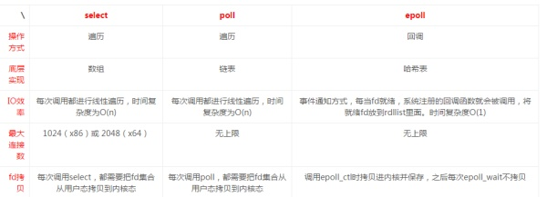

## 待准备的知识点
1. fork/join (分而治之)
2. redis主从复制原理及无磁盘复制分析 
3. MySqL B+树机制
4. SpringBoot 
5. 信号量（信号量是一个确定的二元组（s，q））
6. 进程间的通信方式 （共享内存模式、消息传递模式、共享文件模式）
7. select/poll/epoll/kqueue(BSD/Mac OS X)
8. Iaas Paas Saas 区别
9. RMI协议，RMI穿透防火墙问题
10. mysql 怎样将数据同步到 elasticsearch中
11. 原子性和和一致性的区别
12. DelayQueue

## 遇到的问题难点及解决
1. db冗余设计
2. git需求分管理，新的需求最好新的分支，最好跟周期长的需求独立开来，特别是公共的组件独立分支
3. 需求维护，兼容设计，前提保证已有业务正常运行，针对新的规则，是在原理的基础上改（db,code）,还是扩展新的（表，method）维护老的，还有考虑到异步数据，时间，用户维度综合考虑
4. 异步task设计时，是通过事件触发还是时间触发，要综合考虑
5. 合理的去拆分业务，建索引时，当索引过大时，对内存会有高的要求，必须颗粒化索引，是根据时间（小时，周，月），用户（level）,业务来拆分要综合

## 案例和提升1 （websocket发送健康数据）
1. 心跳包检测存活
2. 空轮询的问题，通过netty来解决 （websocket协议）

## 解释知识点
1. 
2. 
3. 
4. 
5. 
6. 
7. 结构，IO效率性能，fd拷贝，最大连接数,epoll对文件描述符的操作有两种模式：LT(level trigger，水平触发)和ET(edge trigger)，消息传递
select,poll内核拷贝到用户空间，epoll通过共享一个内存nmap

8. 
9. 通过jmxmp协议解决防火墙其问题
10. https://www.jianshu.com/p/96c7858b580f，github 上有go的插件
11. 原子性侧重不可事务的完整，要么成功提交，要么都回滚，一致性是在原子性的基础上，保证逻辑上正确，数据都对的。https://segmentfault.com/q/1010000005984017
12. http://ifeve.com/%E5%B9%B6%E5%8F%91%E9%98%9F%E5%88%97-%E6%97%A0%E7%95%8C%E9%98%BB%E5%A1%9E%E5%BB%B6%E8%BF%9F%E9%98%9F%E5%88%97delayqueue%E5%8E%9F%E7%90%86%E6%8E%A2%E7%A9%B6/

