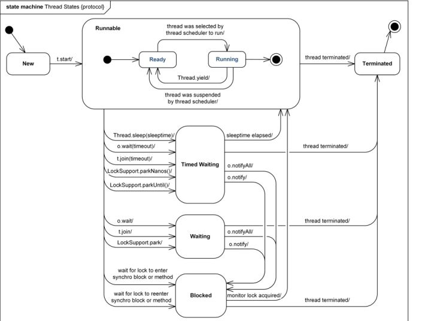

## JMM
* 原子性
* 可见性
* 可序性

## volatile,synchronized,reentrantLock

## 线程的生命周期
* new
* runnable (ready,running)
* wait
* timed_wait
* block
* terminated

## java 线程池创建的方式（通过 Exectors 4种）
* newCache
* newFix
* newSingle
* newSchedule

## fork/join (http://ifeve.com/talk-concurrency-forkjoin/)
### 5大类
* ForkJoinPool 实现ForkJoin的线程池
* ForkJoinWorkerThread  实现ForkJoin的线程
* ForkJoinTask<V> 一个描述ForkJoin的抽象类
* RecursiveAction 无返回结果的ForkJoinTask实现
* RecursiveTask<V> 有返回结果的ForkJoinTask实现

## 线程池的大小配置
一般说来，大家认为线程池的大小经验值应该这样设置：（其中N为CPU的个数）

如果是CPU密集型应用，则线程池大小设置为N+1
如果是IO密集型应用，则线程池大小设置为2N+1
如果一台服务器上只部署这一个应用并且只有这一个线程池，那么这种估算或许合理，具体还需自行测试验证。

但是，IO优化中，这样的估算公式可能更适合：

最佳线程数目 = （（线程等待时间+线程CPU时间）/线程CPU时间 ）* CPU数目

因为很显然，线程等待时间所占比例越高，需要越多线程。线程CPU时间所占比例越高，需要越少线程。

下面举个例子：

比如平均每个线程CPU运行时间为0.5s，而线程等待时间（非CPU运行时间，比如IO）为1.5s，CPU核心数为8，那么根据上面这个公式估算得到：((0.5+1.5)/0.5)*8=32。这个公式进一步转化为：

最佳线程数目 = （线程等待时间与线程CPU时间之比 + 1）* CPU数目

刚刚说到的线程池大小的经验值，其实是这种公式的一种估算值

## 资料
* [https://www.cnblogs.com/domi22/p/8046796.html](https://www.cnblogs.com/domi22/p/8046796.html)
* [线程流程图]  (https://www.uml-diagrams.org/java-thread-uml-state-machine-diagram-example.html)