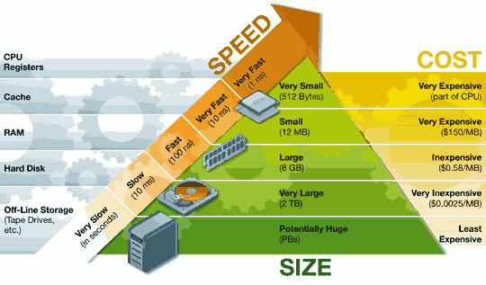

## 各组件速率图

disk mem 10万
mem cache 几十
mem register 几百

## 资料
* [为什么寄存器比内存快](http://www.ruanyifeng.com/blog/2013/10/register.html)
* [CPU Cache与高性能编程](https://blog.csdn.net/karamos/article/details/80126704)