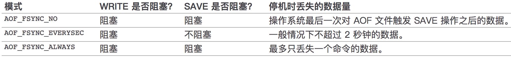

## 客户端连接服务器
src/redis-cli -h 10.24.31.96 -p 7379

## 获取版本
10.24.31.96:6379> info
# Server
redis_version:3.0.7

## 数据结构
字符串、列表、集合、有序集合、哈希

## 数据持久化
### RDB快照
* 二进制数据库文件，时间+次数 fork 进程 saveTo tempFile,然后rename tempFile to rdb文件，在生成快照前后这段时间的数据因服务宕机可能丢失

### AOF（Append Only File）日志
* 协议文本数据库文件，保存数据修改命令
* aof 重写，瘦身，保存add命令即可
* 保存模式 
> AOF_FSYNC_NO
> AOF_FSYNC_EVERYSEC
> AOF_FSYNC_ALWAYS

## 内存结构和管理
> 内存的大小放入内存头中

## 内存回收策略 (lru,random,ttl)
volatile-lru -> remove the key with an expire set using an LRU algorithm
allkeys-lru -> remove any key accordingly to the LRU algorithm
volatile-random -> remove a random key with an expire set
allkeys-random -> remove a random key, any key
volatile-ttl -> remove the key with the nearest expire time (minor TTL)
noeviction -> don't expire at all, just return an error on write operations

## 参考资料
[http://redisbook.readthedocs.io/en/latest/internal/aof.html](http://redisbook.readthedocs.io/en/latest/internal/aof.html)
[https://yq.aliyun.com/articles/67122](https://yq.aliyun.com/articles/67122)
[https://www.biaodianfu.com/redis-vs-memcached.html](https://www.biaodianfu.com/redis-vs-memcached.html)