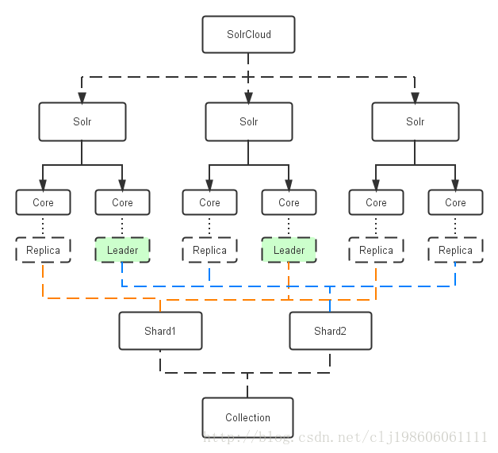

## 概述
> Solr is a search server built on top of Apache Lucene, an open source, Java-based, information retrieval library. It is designed to drive powerful document retrieval applications - wherever you need to serve data to users based on their queries, Solr can work for you

## 安装启动
> bin/solr start -e cloud
* 脚本命令详见 [http://lucene.apache.org/solr/guide/7_3/solr-control-script-reference.html#solr-control-script-reference](http://lucene.apache.org/solr/guide/7_3/solr-control-script-reference.html#solr-control-script-reference)

## facet
> One of Solr’s most popular features is faceting. Faceting allows the search results to be arranged into subsets (or buckets, or categories), providing a count for each subset. There are several types of faceting: field values, numeric and date ranges, pivots (decision tree), and arbitrary query faceting.

> facet主要用于导航实现渐进式精确搜索
### 类型

* facet.field
* 数字和时间区间 `时间 start,end,gap   `
* facet分组，`facet.pivot=genre_str,directed_by_str`
* facet.query 

## suggest
> 配置步骤
* add suggest search compoment
在 solrconfig.xml 配置
* add suggest request handler
在 solrconfig.xml 配置

## highlight
> hl pre post

## spell check
> 相似或相近词

## solrCloud
> 结构图

* 索引（Collection）的逻辑图
* 

        
* solr和索引对照图
* 

* 创建索引过程
* 

        
* 查询过程
* 

* 索引分裂 (自动或手动触发)

## 京东搜索研究
类目/category
属性/tag
品牌/brand

* 商品规格 
> 手机类目：颜色，尺寸，网络，内存，存储，CPU,操作系统

* 商品货品区别

## 参考文献
[http://lucene.apache.org/solr/guide/7_3/index.html](http://lucene.apache.org/solr/guide/7_3/index.html)
[https://blog.csdn.net/clj198606061111/article/details/21816985](https://blog.csdn.net/clj198606061111/article/details/21816985)
