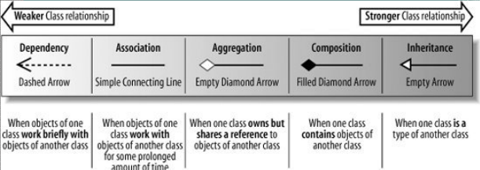

## 总结
> 类图、用例图、顺序图、活动图、状态图、组件图

## 类图

> 各种关系的强弱顺序
**泛化 = 实现 > 组合 > 聚合 > 关联 > 依赖***
* 泛化 带三角箭头的实线，箭头指向父类 继承
* 实现 带三角箭头的虚线，箭头指向接口 实现接口
* 组合 带实心菱形的实线，菱形指向整体，公司不能离开部门
* 聚合 带空心菱形的实心线，菱形指向整体，汽车可以离开轮子
* 关联 带普通箭头的实心线，指向被拥有者，一种拥有关系，老师与学生
* 依赖 带箭头的虚线，指向被使用者，是一种使用的关系，人计算机

## 资料
[http://www.uml.org.cn/oobject/201610282.asp](http://www.uml.org.cn/oobject/201610282.asp)
[https://blog.csdn.net/a19881029/article/details/8957441](https://blog.csdn.net/a19881029/article/details/8957441)
